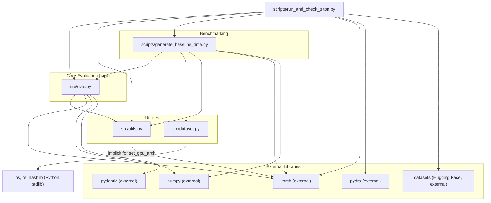

# Dependency Analysis and Execution Flow for `scripts/run_and_check_triton.py`

This document outlines the dependencies and operational flow of the `scripts/run_and_check_triton.py` script, which is used to evaluate custom Triton or CUDA kernels against reference PyTorch implementations within the KernelBench framework.

## Dependency Graph

The following diagram illustrates the relationships between the key Python modules involved:

## Key Python Modules and Their Roles

1.  **`scripts/run_and_check_triton.py` (Entry Point):**
    *   **Purpose:** Orchestrates the comparison of a custom kernel (Triton or CUDA) against a reference PyTorch implementation.
    *   **Operations:**
        *   Parses command-line arguments (using `pydra`) for paths to reference/kernel code, dataset details, and evaluation parameters.
        *   Loads reference PyTorch code (either from a local file or the "ScalingIntelligence/KernelBench" Hugging Face dataset).
        *   Loads the custom kernel code from a local file.
        *   Optionally detects if the kernel is Triton-based.
        *   Calls `src.eval` functions to perform correctness and performance evaluation.
        *   Calls `scripts.generate_baseline_time.measure_program_time` to benchmark the reference PyTorch code (eager and `torch.compile`).
        *   Prints a summary of results, including speedups.
    *   **Key Dependencies:** `src.eval`, `src.utils`, `scripts.generate_baseline_time`, `torch`, `pydra`, `datasets`.

2.  **`src/eval.py` (Evaluation Engine):**
    *   **Purpose:** Contains the core logic for evaluating kernel implementations.
    *   **Operations:**
        *   Provides functions to load, compile/JIT, and run both reference (`Model`) and custom (`ModelNew`) PyTorch modules.
        *   Handles specific evaluation paths for CUDA (`eval_kernel_against_ref`) and Triton (`eval_triton_kernel_against_ref`) kernels, including an auto-detection mechanism (`eval_kernel_against_ref_auto`).
        *   `detect_triton_kernel`: Identifies Triton code.
        *   `run_and_check_correctness`: Compares numerical outputs.
        *   `time_execution_with_cuda_event`: Measures GPU execution time accurately.
        *   Manages build directories and compilation/JIT caches.
    *   **Key Dependencies:** `src.utils`, `torch`, `numpy`, `pydantic`.

3.  **`src/utils.py` (Utilities):**
    *   **Purpose:** Provides various helper functions.
    *   **Relevant Operations for this flow:**
        *   `read_file()`: Reads file contents.
        *   `set_gpu_arch()`: Sets environment variables for PyTorch for target GPU architectures.
        *   `construct_problem_dataset_from_problem_dir()`: Used to list problem files.
    *   **Key Dependencies:** `os`, `re`, `hashlib`.

4.  **`scripts/generate_baseline_time.py` (Baseline Benchmarking):**
    *   **Purpose:** Measures and records the performance of reference PyTorch models from KernelBench.
    *   **Operations:**
        *   `measure_program_time()`: Loads a reference model, optionally applies `torch.compile`, and measures its execution time using `src.eval.time_execution_with_cuda_event`. This is crucial for providing a performance baseline.
    *   **Key Dependencies:** `src.eval`, `src.dataset`, `src.utils`, `torch`, `numpy`.

5.  **`src/dataset.py` (Dataset Handling):**
    *   **Purpose:** Provides functions to discover and structure KernelBench problem sets.
    *   **Operations:**
        *   `construct_problem_dataset_from_problem_dir()`: Lists Python files in KernelBench level directories.
    *   **Key Dependencies:** `os`, `re`, `hashlib`.

## Overall Execution Flow of `scripts/run_and_check_triton.py`

1.  **Initialization & Configuration:**
    *   The script parses command-line arguments via `pydra` (`ScriptConfig`).
    *   `src.utils.set_gpu_arch()` configures target GPU architectures.

2.  **Loading Reference Code:**
    *   Loaded either from a local file path (`config.ref_arch_src_path`) using `src.utils.read_file()`, or
    *   Fetched from the "ScalingIntelligence/KernelBench" Hugging Face dataset based on `config.level` and `config.problem_id`.

3.  **Loading Custom Kernel Code:**
    *   The custom kernel source is loaded from `config.kernel_src_path` using `src.utils.read_file()`.

4.  **Kernel Type Detection (Optional):**
    *   If `config.auto_detect` is true, `src.eval.detect_triton_kernel()` analyzes the custom kernel source.

5.  **Custom Kernel Evaluation (via `src.eval`):**
    *   The script calls an appropriate evaluation function in `src.eval` (`eval_triton_kernel_against_ref`, `eval_kernel_against_ref_auto`, or `eval_kernel_against_ref`).
    *   **Inside `src.eval`:**
        *   Reference model (`Model`) and custom kernel model (`ModelNew`) are loaded and instantiated. This involves dynamic execution of source code, and for Triton, temporary file creation and module import.
        *   CUDA kernels might be compiled into extensions; Triton kernels are JIT-compiled.
        *   Correctness is verified by `run_and_check_correctness()` by comparing outputs over multiple trials.
        *   Performance is measured by `time_execution_with_cuda_event()` if correctness passes.
        *   A `KernelExecResult` (compilation status, correctness, runtime, metadata) is returned.

6.  **Baseline Performance Measurement (via `scripts.generate_baseline_time`):**
    *   `scripts.generate_baseline_time.measure_program_time()` is called for the reference code:
        *   Once for PyTorch eager mode (`use_torch_compile=False`).
        *   Once for `torch.compile` with Inductor backend.
    *   These calls also use `src.eval` functions for model loading and timing.

7.  **Reporting Results:**
    *   The script outputs:
        *   The custom kernel's `KernelExecResult`.
        *   Execution times for the reference (eager and compiled) and custom kernels.
        *   Speedup figures if the custom kernel is correct. 